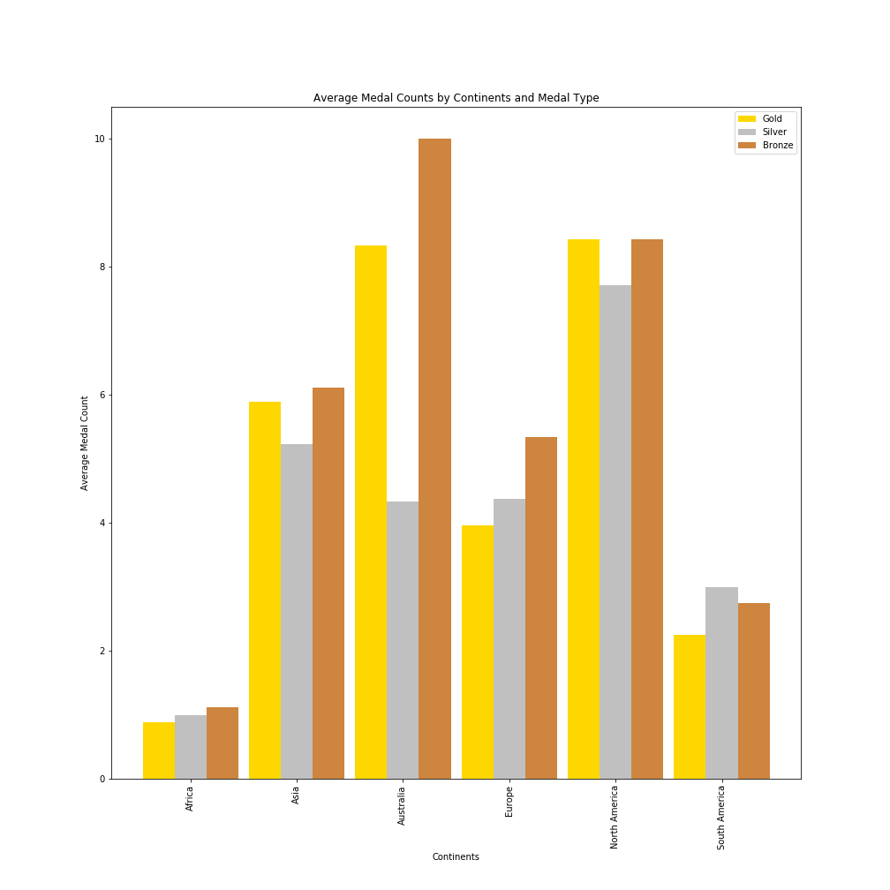
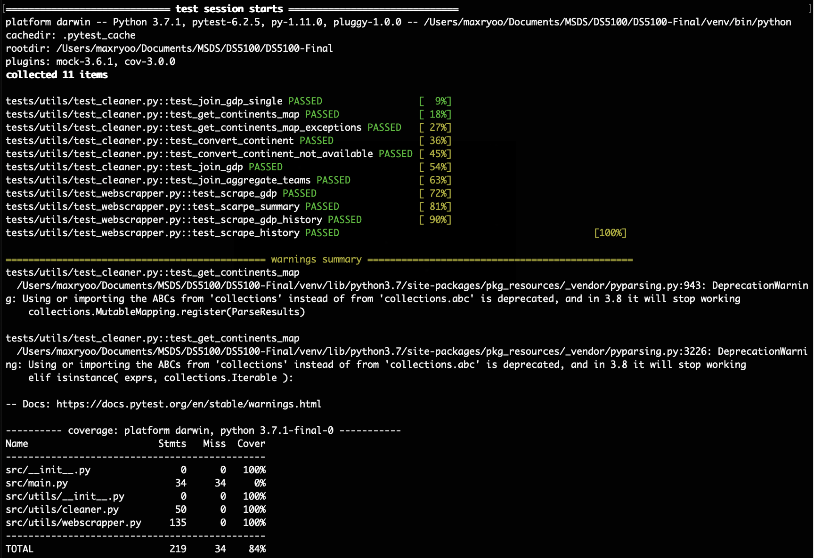

## Final Report
Group 6: 2021 Tokyo Olympics

Members

* Reilly Meinert
* Max Ryoo
* Said Mrad 
* Sydney Masterson

## Introduction
The purpose of this project is to examine the data from the 2021 Tokyo Olympics and see what factors contributed to the earning of medals for each country. The group wanted to see if any external factors / information such as GDP or geographical location had an impact on earning medals at the Tokyo Olympics.

## Data
The data utilized for this study / project was obtained from a variety of sources. Some data was scraped directly from the official olympics website or a GDP tracking website, while some other datasets were provided by Kaggle. The main reasoning behind some data being pulled or scrapped was the continuously changing official olympics website. Originally all data was available from the olympics website, however, after their redesign of the user interface, some information could not be pulled, which is why some external sources were used to fulfill the groups curiosity of different factors that may impact medal counts for each country. 

There were four main resources to collect all the data for analysis. The first source was the official olympic website. Two main datasets were created from this datasource. The first dataset was the Olympic medal count for the 2021 Tokyo Olympics found at (https://olympics.com/en/olympic-games/tokyo-2020/medals). However, with the redesign of the Olympics website, the group was able to pull all the medal counts for summer olympics that took place after 1986. 

The second resource was to collect the recent GDP of each country found at https://www.worldometers.info/gdp/gdp-by-country/, which was scrapped to get the most recent GDP for each country that participated in the Tokyo Olympics. 
	
Although the second datasource had a relatively clean dataset to map the countries, the limitation of the source was providing only recent GDP data. Since the group was able to web scrape historical data from the Olympics website, the group needed another datasource that had the GDP for each country for the Olympics that occurred before 2021 and after 1986. For historical GDPs the group utilized the source https://countryeconomy.com/gdp . One limitation of this source was that although the majority of countries were found, countries being renamed was a hindrance to do a one to one mapping. For the missing entries the group placed null values since the sample with no one to one mapping to the source was relatively low. 

The final source that was utilized was Kaggle. When the group originally pulled the data from the official olympics website, a breakdown of teams was provided, but with the redesign of the website that source was not available anymore. Therefore, the group decided to use a Kaggle dataset that provided a team breakdown for each country for the Tokyo 2021 Olympics because the Kaggle dataset had the information of the website before the website redesign. 

Although many fields were parsed and pulled from various sources, the group also wanted to provide additional information to fortify their dataset such as geographical location of where each country was located. For this field the group utilized external python packages available through PIP, such as the pycountry / pycountry-convert packages to map each country to a continent. The group wanted to see if geographical region affected the medal counts for each country, which was the motivation of doing more data engineering for the datasource. 

## Exploratory Data Analysi (EDA)

After all the data cleaning was completed, the group decided to conduct exploratory data analysis on the dataset with visualizations to understand the data better. First the group wanted to see the distributions for some of the columns in our dataset. In Figure 1, the group visualized the distribution of the continents for the data. We wanted to dive deep into how each continent was represented at the Tokyo Olympics.

<strong>Figure 1 </strong>Continent Distribution for 2021 Tokyo Olympics 

After seeing the distribution of the continents, the next main column to visualize was the total medal count for each country. Figure 2 shows the distributions of medals earned by each country. As expected, the distribution was right skewed , which indicated that only a couple of countries had a high medal count and that the medals earned weren’t evenly distributed between the countries. 

<strong>Figure 2 </strong>Total Medal Count Distribution 

However, this visualization was only for total count and the group wanted to also visualize how each country’s distribution of medals were. Figure 3 shows the distribution of medal count separated by the type of medal with the colors representing each medal type. 

<strong>Figure 3 </strong>Distribution of Medal Count by Medal Type

Although the visualization was great for initial understanding, the group wanted to narrow down the countries to see the top 10 performing countries for the Tokyo Olympics. The official olympics website sorts the top nations by how many gold medals were earned during the olympics. Therefore, the group selected the top 10 nations with the highest gold medal counts and visualized the distribution of medal types for those countries as shown in Figure 4. 

<strong>Figure 4 </strong>Top 10 Nations Distribution of Medals Earned

With this initial analysis, the group wanted to see the initial motivation of investigating this dataset, which was the effect of GDP with the medals earned at the olympics. To visualize the relationship, a scatter plot was constructed between the two variables at question as shown in Figure 5.

<strong>Figure 5</strong> Total Medals Won vs GDP Per Capita

The scatter plot shows a weak linear relationship between the GDP per capita and total medals won partially due to the lower GDP countries having a lower total medal count when compared to higher GDP countries. However, this can be explained by distribution of medal counts not being normally distributed. However, we could say that most nations that had a higher GDP generally performed better than the nations with lower GDPs in the 2021 Tokyo Olympics. 

One final visualization the group wanted to showcase was the relationship between the continents and the medals earned. Figure 6 shows the distribution of total medals for each continent.

<strong>Figure 6</strong> Distribution of Medals Won for Each Continent

The group also averaged the medal counts for each continent to remove any potential outliers, which is shown in Figure 7 below.

<strong>Figure 7</strong> Average Medals Won by Each Continent

## Model Building
From the initial exploratory data analysis, the group wanted to generate a model that could predict how many medals a country will earn based on the fields that were generated from the data pull. The group created a Multiple Linear Regression model to fit on the dataset. The model was fit with the following predictors: continent, number of teams, GDP, Population, GDP growth, GDP per capita. The full multiple regression model is shown by the table of coefficients in Figure 8.

<strong>Figure 8</strong> Coefficient Matrix of Multiple Linear Regression

From the given coefficient matrix, we can see that the main feature of GDP had a value of 0, which means that it did not have a big impact on the prediction of medals earned for a country when all the given predictors were used. However, further analysis needs to be done to say that GDP does not play a role. This could be because of multicollinearity within the predictors themselves. However, for this project the group determined that this investigation was out of scope of this project deliverable and would later investigate this issue. 

From the initial creation of the model, the following statistics were generated. `R-Squared = 0.8479990568528668`, `MSE = 109.1391895919251`, and `RMSE = 10.446970354697342`. 

## Time Series

After producing our multiple linear regression model for our Tokyo Olympic Data, our group wanted to visualize the greater olympic data pulled from the historical archive of the official olympics website. The group was able to divide each country into their respective continents and provide a time series analysis visuzaliations of medal counts for each continent along with its average. In the 6 x 4 matrix plot as shown in Figure 9, each row represents a continent while each column represents the type of medal earned with the order being total, gold, silver, and bronze. 

<strong>Figure 9</strong> Time Series Analysis Visualization

Through this visualization we can quickly see how each continent is performing at the olympics throughout history. The biggest change that can be seen is the medal count for Australia, where the trend has almost always increased since the day records could be found. Although each row has different limits for the y-axis (medal count), we can see most continents have increased in their medal earnings throughout history. The y axis was not held constant for all continents due to the significant difference of medal earnings between the continents. 

## Unit Testing
The group wanted to make sure that all parts of the program ran the way we intended the program to run as well as have data quality checks to make sure that the data collected / scrapped weren’t bizarre. The group utilized pytest to run all the tests and had a passing rate of 100% and coverage of 100% for all methods except the main method, which was only used to call the methods of each class. All test files can be found in the tests directory, which maps to the src directory. Two custom classes were created to ease the data pull process, which were both thoroughly tested. 

## Project Management

The group was able to work in an agile way by delivering minimal viable products (MVP) through the project. The group took an iterative approach to complete each milestone of the project step by step so we don’t overcommit on an issue that the group does not identify as high priority. 

## Extra Credit

For the extra credit opportunity the group chose to web scrape some datasets used for the projects. We wanted to hone our data scraping scales in Python. The group was able to use this extra credit opportunity to combine different datasets to best match the goal of this project. 

Also, the group decided to follow industry standards for project organization and the datapull portion itself could be later packaged as a pip python package due to the usage of virtual environments as well as a pip requirements file that had all the components needed to recreate the project data pull. 

The group also wanted to enhance the wait time of the data pull, which was not very long, but enough time to get bored while waiting. The group utilized an external package called progress bar to integrate a small graphic to provide how much of the data pull was complete to the user running the datapull. 

## Conclusion
To conclude, the ultimate goal of this project was to see what factors contributed to the earning medals for each country. 

Data was pulled through webscraping from the Olympics website (Tokyo Olympics as well as all summer olympics dating back to 1986), a GDP tracker (Most recent GDP), a historical GDP tracker and finally a kaggle dataset (with teams breakdowns) that were added as features to see if any external factors or information had on impact on earning medals at the Tokyo Olympics. The features chosen to examine were GDP, geographic location (continents), discipline, Population, GDP growth and GDP per capita with the response variable being the medal count.

An exploratory data analysis (EDA) was conducted to see the distribution of some of our variables in univariate analysis which showed that only a couple of countries had a high medal count and that the medals earned weren’t evenly distributed between the countries. Following that, bivariate analysis was conducted in the form of a scatter plot and bar charts. The scatter plot showed a weak linear relationship between the GDP per capita and total medals won partially due to the lower GDP countries having a lower total medal count when compared to higher GDP countries while the bar charts showed that some continents performed better than others with low performances especially in African and South American countries.

From the initial exploratory data analysis, a Multiple linear Regression model was created to fit on the dataset with the goal of predicting how many medals a country will earn based on the fields that were generated from the data pull. The model was fit with the following predictors: continent, number of teams, GDP, Population, GDP growth, GDP per capita. From the given coefficient matrix, we can see that the main feature of GDP had a value of 0, which means that it did not have a big impact on the prediction of medals earned for a country when all the given predictors were used, it can be attributed to multicollinearity as continents performance and GDP are correlated.

The group then wanted to visualize the greater olympic data pulled from the historical archive of the official olympics website dividing each country into their respective continents and providing a time series analysis visuzaliations of medal counts for each continent along with its average. The biggest change that can be seen is the medal count for Australia, where the trend has almost always increased since the day records could be found we can see most continents have increased in their medal earnings throughout history

An MVP was delivered through the project using agile methodology.
